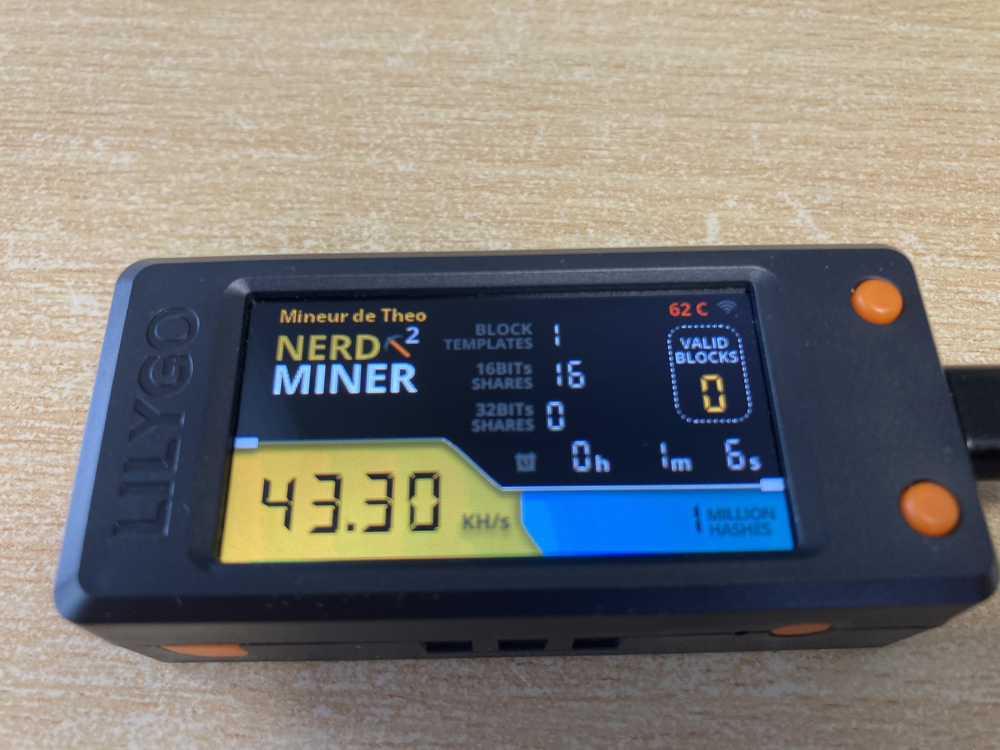

# NerdSoloMiner
**The NerdSoloMiner v2**

This is a **free and open source project** that let you try to reach a bitcoin block with a small piece of hardware. 

The main aim of this project is to let you **learn more about minery** and to have a beautiful piece of hardware in your desktop.

Original project https://github.com/valerio-vaccaro/HAN

## Requirements
- TTGO T-Display S3
- 3D BOX [here](3d_files/)

### Project description
**ESP32 implementing Stratum protocol** to mine on solo pool. Pool can be changed but originally works with ckpool.

This project is using ESP32-S3, uses WifiManager to modify miner settings and save them to SPIFF. 

This miner is multicore and multithreads, each thread mine a different block template. After 1,000,000 trials the block in refreshed in order to avoid mining on old template.

***Current project is still in developement and more features will be added***

## Build Tutorial
### Hardware requirements
- TTGO T-Display S3 > Buy it on aliexpress or amazon
- 3D BOX

### Software Tutorial
1. Clone this git
1. Change your setup in the src/config.h
1. Launch Visual Studio Code in this project repository (will install all the need)
1. Go in the PlatformIO and lauch "Upload and Monitor"

#### Build troubleshooting
1. Build errors > If during firmware download upload stops, it's recommended to enter the board in boot mode. Unplug cable, hold left bottom button and then plug cable. Try programming

### NerdMiner configuration

Optional you can select other pool:

| Pool URL                 | Port | URL |
|---                       |---   |---  | 
| solo.ckpool.org          | 3333 | https://solo.ckpool.org/ |
| btc.zsolo.bid            | 6057 | https://zsolo.bid/en/btc-solo-mining-pool |
| eu.stratum.slushpool.com | 3333 | https://braiins.com/pool |

## Developers
### Project guidelines
- Current project was addapted to work with PlatformIO
- Current project works with ESP32-S3 but any ESP32 can be used.
- Partition squeme should be build as huge app
- All libraries needed shown on platform.ini

### On process
- [x]  Move project to platformIO
- [x]  Bug rectangle on screen when 1milion shares
- [x]  Bug memory leaks
- [x]  Turn off the screen with second button
- [x]  Turn off the screen on a time slot
- [x]  Add internal temperature and worker name on screen
- [x]  Bug Reboots when received JSON contains some null values
- [ ]  Improve hashrate using Blockstream Jade miner code
- [ ]  Add blockHeight to screen
- [ ]  Add new screen with global mining stats
- [ ]  Add support to control BM1397

Enjoy
