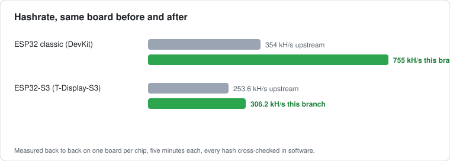
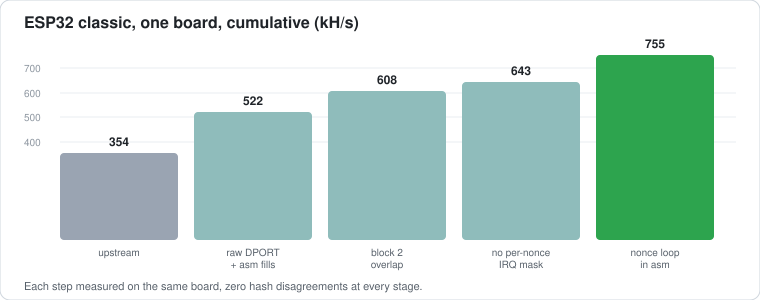

# NerdMiner v2, fork: verified fixes and a rebuilt hardware SHA path

This branch (`all-fixes`) is `BitMaker-hub/NerdMiner_v2` `main` with everything below
merged on top. Flash it and you get the lot. Each change also lives on its own branch
off upstream `main`, so a maintainer can take them one at a time.

Three things you get that upstream does not have yet:

1. **More than twice the hashrate on ESP32 classic**, and a few percent on ESP32-S3.
2. **Fixes for four silent failures** where the miner reported a healthy rate while
   producing work the pool could never accept.
3. **OTA updates over WiFi**, firmware and config, so a miner on a shelf never has to
   come back to a USB cable.

## Hashrate



| Chip | Upstream `main` | This branch | Same, with the display options | Gain |
|---|---|---|---|---|
| ESP32 classic (D0WD-V3, bare DevKit) | 354 kH/s | **755 kH/s** | no display on this board | **+113%** |
| ESP32-S3 (T-Display-S3) | 253.6 kH/s | **306.2 kH/s** | **315.4 kH/s** | **+21%** to **+24%** |

Every pair is one board before and after, never one board against another. Five minutes
per build, around 290 samples, every submitted hash cross-checked against a software
implementation.

The middle column is measured with the same options upstream runs, so the comparison
isolates the SHA path. The fourth column adds two display flags that cost nothing to
adopt and are described further down. Both are the same firmware.



The gap between the two chips is not an accident. The S3 spends most of a nonce waiting
on the APB bus, roughly 16 cycles per register access and about 39 accesses per nonce,
so there is little software left to remove. On the classic the software overhead was the
dominant term, and that is what these changes take out.

### Where the time goes, per nonce

```
ESP32 classic, 3 engine blocks per nonce
  fill block 1 (16 words) -> START -.
                                     \  block 2 is written while the engine
  fill block 2 (16 words) <----------'   is still hashing block 1
  CONTINUE -> wait -> LOAD digest
  pad + START (second sha) -> wait -> LOAD -> read word 7, reject early

ESP32-S3, 2 engine blocks per nonce
  restore midstate (8 words) -> fill block 2 -> CONTINUE -> wait
  digest H -> TEXT -> START (second sha) -> wait -> read H[7], reject early
```

The S3 can restore a midstate because `SHA_H` is writable there, so block 1 is hashed
once per job instead of once per nonce. The classic cannot: it exposes `SHA_TEXT` and
the command registers only, and writing `SHA_TEXT` supplies a *message*, never a
*state*. Since the second sha destroys the accumulator, block 1 has to be replayed for
every nonce. Three engine blocks on classic is not waste, it is the only thing the
silicon allows.

### What each change does

| Change | Gain | Why it works |
|---|---|---|
| Raw DPORT reads | +28% | `DPORT_REG_READ` becomes a function call when the DPORT workaround is on, and the busy-wait paid it on every poll |
| SHA blocks filled in assembly | +9% | gcc materialises an absolute address per register write, three instructions each; one base register and immediate offsets removes that |
| Block 2 written during block 1 | +16% | its words do not depend on block 1's result, and the engine latches its message at `START` |
| Nonce loop inside the assembly | +19% | every asm block clobbers memory, so returning to C between them forced gcc to reload everything, five times per nonce |
| Per-nonce DPORT interrupt mask dropped | +5.7% | it only ever protected the two-read DPORT sequence, which the raw read no longer uses |

## A silicon limitation on ESP32 classic, and where we are with it

Running this firmware with a software cross-check on every candidate, we see rare
disagreements on ESP32 classic: the hardware engine returns a hash that a software
implementation does not reproduce for the same header and nonce. Around **0.3 per hour
per board**, against roughly 41,000 candidates checked per hour, so about **one in
130,000**. The six ESP32-S3 boards show none at all over 1.96 million checked
candidates, where the classic rate predicted 6.3.

What it is not, measured rather than assumed:

- Not the register read. Re-reading the digest on a disagreement returns the same wrong
  value every time, six times out of six.
- Not our nonce accounting. None of the neighbouring nonces reproduces the hash either.
- Not the raw DPORT read this firmware uses. Putting the protected DPORT sequence back
  made it **worse**, twice, on two different boards: 5.96 disagreements per hour against
  0.32 and 0.00 on the untouched controls.

Espressif documents the mechanism. Erratum **CPU-3.16**, "There Are Limitations to the
CPU Access to 0x3ff0_0000 ~ 0x3ff1_efff and 0x3ff4_0000 ~ 0x3ff7_ffff Address Spaces",
states that simultaneous access by the two CPUs can lose some accesses, and prescribes
inserting a `MEMW` instruction before the access. `SHA_TEXT_BASE` on ESP32 classic sits
at 0x3FF03000, inside that range, and the second core runs the software miner flat out.
Erratum **CPU-3.3** adds that consecutive writes to the same address may be lost, which
matches the two message words this code writes twice per nonce, once for each block.

Two mitigations were measured and neither works, so neither is in this branch:

- A `MEMW` barrier before the engine start command, 1.4% of hashrate. The treated board
  produced a disagreement within eighty minutes while the two controls stayed clean.
- Stopping the software miner on the second core, 5.3% of hashrate, to test the erratum's
  stated cause directly. Five disagreements in 6.9 board-hours, an unchanged rate.

Two further things the instrumentation established, each from ten or more events. Re-reading
the digest on a disagreement returns the same wrong value every time, so the registers
really do hold a wrong result rather than a misread one. And no neighbouring nonce
reproduces that hash, so the nonce accounting is not drifting either. The engine was fed
something other than what we believe we wrote, and we have not found what.

The defect discards about **one candidate in 100,000**, which is 0.02 kH/s across our
whole fleet. The cheapest mitigation we found costs 32 kH/s, roughly 1400 times the
damage. So we document it and leave it, with the per-candidate software check left on to
catch any change of regime.

One thing that does not work, so nobody retries it: moving those two writes into the
LOAD wait, which would have cost nothing. The engine refuses writes while a LOAD is in
flight, the startup known-answer test failed within twenty seconds, and 3243
disagreements followed.

Worth keeping in proportion: at one candidate in 130,000, the odds of this costing a
found block are far below the odds of finding one. It matters for understanding, not for
earnings.

## Four silent failures

The pattern that cost us the most time: the miner shows a normal hashrate, a normal
temperature, and produces nothing the pool will take. Nothing in the firmware said so.

| What | Effect |
|---|---|
| Submitted nonce lost its leading zeros | 1 submission in 16 malformed, including a found block with the same odds |
| Coinbase over 255 bytes silently truncated | every share rejected, on any pool with a slightly larger coinbase |
| Block 2 padding held leftover header words (classic path, introduced by an earlier optimisation of ours) | every hash computed over a wrong padding block |
| A posted command write overtaken by the busy poll | the engine read as idle before it had started |

Two habits came out of it, both in this branch:

- **A known-answer test at startup.** The firmware hashes block 125552, whose header,
  nonce and hash are public, through the exact compiled path, and compares against an
  independent software implementation. Verdict in 20 seconds instead of minutes of
  statistics. Enable with `-D VALIDATION=1 -D RACE_KAT=1`.
- **Cross-checking every candidate.** With `-D VALIDATION=1`, every hash that passes
  the 16-zero-bit filter is recomputed in software and compared, about 5 to 11 times a
  second. A systematic breakage shows up within seconds.

## OTA over WiFi

A miner on a shelf, behind furniture, or in a rack should not need a USB cable to get a
fix. This branch adds firmware **and** SPIFFS config updates over the network:

```bash
pio run -e <env>-OTA -t upload   --upload-port <miner-ip>   # firmware
pio run -e <env>-OTA -t uploadfs --upload-port <miner-ip>   # config
```

The miner announces itself over mDNS as `nerdminer-<last 2 bytes of MAC>.local`, so the
address survives a DHCP change. Updates are password protected, and the password is
supplied from the environment at build time, never committed.

One subtlety worth knowing, because it cost us an evening: the SHA engine has to be
free when `esp_image_verify()` checks the uploaded image. The miner tasks go idle and
release the engine lock while an update is in flight, otherwise the upload completes
and then fails verification with no useful message.

## The fixes, one branch each

| Fix | Issue | Branch |
|---|---|---|
| Submitted nonce was truncated when it had a leading zero, losing 1 share in 16 (and a found block with the same odds) | [#750](https://github.com/BitMaker-hub/NerdMiner_v2/issues/750) | `fix/nonce-padding-750` |
| `checkValid()` compared against stack garbage and could loop forever | [#797](https://github.com/BitMaker-hub/NerdMiner_v2/issues/797) | `fix/checkvalid-797` |
| Stats API queried public-pool.io regardless of the configured pool, on 22 of 24 boards | [#710](https://github.com/BitMaker-hub/NerdMiner_v2/issues/710), [#792](https://github.com/BitMaker-hub/NerdMiner_v2/issues/792), [#795](https://github.com/BitMaker-hub/NerdMiner_v2/issues/795) | `fix/pool-api-url-ignored` |
| USB CDC writes blocked the stratum task: **19% hashrate** lost on S3/C3 boards plugged into a host | [#810](https://github.com/BitMaker-hub/NerdMiner_v2/issues/810) | `fix/usb-cdc-blocks-mining` |
| Pool password over 19 chars overflowed a 20-byte buffer into `.bss` | [#811](https://github.com/BitMaker-hub/NerdMiner_v2/issues/811) | `fix/pool-password-overflow` |
| Coinbase over 255 bytes silently truncated, so the pool rejected every share | [#809](https://github.com/BitMaker-hub/NerdMiner_v2/issues/809) | `fix/coinbase-truncation` |
| ckpool-style pools reported 0 workers and no best difficulty | [#739](https://github.com/BitMaker-hub/NerdMiner_v2/issues/739) | `fix/ckpool-stats-format-739` |
| Keepalive kept asking for the hardcoded default difficulty instead of the negotiated one | [#805](https://github.com/BitMaker-hub/NerdMiner_v2/issues/805) | `fix/keepalive-difficulty-805` |
| One-byte out-of-bounds write past `merkle_root` | [#771](https://github.com/BitMaker-hub/NerdMiner_v2/issues/771) | `fix/merkle-root-oob-771` |
| Half-hour and quarter-hour time zones could not be set | [#738](https://github.com/BitMaker-hub/NerdMiner_v2/issues/738) | `fix/half-hour-timezones-738` |
| WiFi never recovered from a lost link: reconnect, full-channel AP scan, RSSI logging | [#583](https://github.com/BitMaker-hub/NerdMiner_v2/issues/583) | `fix/wifi-reconnect` |
| Failed pool DNS resolution cached as `0.0.0.0` | [PR #801](https://github.com/BitMaker-hub/NerdMiner_v2/pull/801) | `fix/pool-dns-resolve-retry` |
| Pool reconnect used `rand() % 60` instead of a backoff | [PR #803](https://github.com/BitMaker-hub/NerdMiner_v2/pull/803) | `fix/pool-reconnect` |
| Undefined behaviour in `to_byte_array`, two `*in++` in one expression | not reported | `fix/to-byte-array-ub` |
| Skipping constant `SHA_TEXT` writes in the hardware miner: **+16.6%** hashrate, measured | [PR #802](https://github.com/BitMaker-hub/NerdMiner_v2/pull/802) | `perf/hw-sha-fast-fill` |
| Rebuilt hardware SHA path, ESP32 and ESP32-S3 | this README | `perf/esp32-sha` |
| OTA was dead on the ESP32 classic target: a single application slot meant the transfer succeeded and the board booted the old firmware again | this README | in `all-fixes` |
| OTA firmware and config updates over WiFi | [PR #804](https://github.com/BitMaker-hub/NerdMiner_v2/pull/804) | `feat/ota-wifi` |

## Measure it yourself

The optimisations are on by default and need no `platformio.ini` change. Set any one to
`0` to measure it in isolation:

```
-D RACE_SHA_DIRECT_READ=0   # back to the protected DPORT sequence
-D RACE_ASM_FILL=0          # back to C register writes
-D RACE_PREFILL=0           # stop overlapping block 2 with block 1
-D RACE_ASM_LOOP=0          # classic: nonce loop back in C
-D RACE_ASM_LOOP_S3=0       # S3: same
-D VALIDATION=1 -D RACE_KAT=1   # cross-check every candidate, and test at startup
```

Compare only the same board before and after. Comparisons between boards are polluted
by silicon, temperature and the state of the panel: we measured a 15x difference in
rare hash disagreements between two boards running byte-identical firmware.

## What is measured, and what is not

Honesty matters more than the numbers here, so:

- The hashrate figures come from this code running on our own fleet, three ESP32
  classic and six ESP32-S3, and are cross-checked against pool-side accepted shares.
- **This branch has been run on hardware, on both chip families.** On an ESP32-S3 it
  reached 315.4 kH/s and on an ESP32 classic 754.2 kH/s, in both cases matching our own
  working firmware to within a tenth of a percent, with the startup known-answer test
  green and no hash disagreement. Each run was measured against the untouched boards
  next to it. For remote observation the test build carried our telemetry task on top;
  the mining path under test is this branch's, and telemetry runs in its own task and
  does not touch it.
- The raw DPORT read assumes nothing else touches those registers while the engine
  lock is held. That holds in our configuration. Boards that drive a display or I2C
  from the second core should verify it.
- We got things wrong along the way and corrected them in public. If something here
  does not hold up, open an issue on this fork.

## Other boards

Everything here was measured on the two chips we own, ESP32-S3 (T-Display-S3) and
ESP32 classic (bare DevKit). The techniques are not specific to those boards, but the
numbers are, and we will not guess at figures for hardware we cannot run.

If you have a supported board that is not one of those two and you want it looked at,
we are happy to do the work: profile the hot path, port what applies, and publish the
before and after the same way. Send one and we will measure it properly. Open an issue
on this fork and we can sort out the details.

Boards where there is a good chance of finding something: anything on ESP32-C3 or
ESP32-S2, where the SHA peripheral differs again, and any board whose display sits on
the same bus as something in the mining path.

## Display options, worth a few percent

Two flags, both off by default, both measured:

```
-D SCREEN_TIMEOUT_S=120   # blank the panel after two minutes, any button wakes it
-D RACE_DRAW_EVERY_S=3    # full redraw every 3 s instead of every second
```

Together they are worth about 1.8% on a healthy panel, and they spare a screen nobody
is looking at.

The hardware miner is also pinned to core 0 on dual-core boards, away from Monitor and
Stratum, worth about 0.8 kH/s per board. Set `-D PIN_HW_MINER_CORE0=0` to go back to
the default placement.

---

# NerdSoloMiner

**The NerdSoloMiner v2**

This is a **free and open source project** that let you try to reach a bitcoin block with a small piece of hardware.

The main aim of this project is to let you **learn more about minery** and to have a beautiful piece of hardware in your desktop.

Original project https://github.com/valerio-vaccaro/HAN


## Requirements

- TTGO T-Display S3 or any supported boards (check Build tutorial 👇)
- 3D BOX [here](3d_files/)

### Project description

**ESP32 implementing Stratum protocol** to mine on solo pool. Pool can be changed but originally works with [public-pool.io](https://web.public-pool.io) (where Nerdminers are supported).

This project was initialy developed using ESP32-S3, but currently support other boards. It uses WifiManager to modify miner settings and save them to SPIFF.
The microMiner comes with several screens to monitor it's working procedure and also to show you network mining stats.
Currently includes:

- NerdMiner Screen > Mining data of Nerdminer
- ClockMiner Screen > Fashion style clock miner
- GlobalStats Screen > Global minery stats and relevant data

This miner is multicore and multithreads, both cores are used to mine and several threads are used to implementing stratum work and wifi stuff.
Every time an stratum job notification is received miner update its current work to not create stale shares.

**IMPORTANT** Miner is not seen by all standard pools due to its low share difficulty. You can check miner work remotely using specific pools specified down or seeing logs via UART.

**_Current project is still in developement and more features will be added_**

## Build Tutorial

### Hardware requirements

- LILYGO T-Display S3 (original one) or any other supported boards
- 3D BOX [here](3d_files/)

#### Current Supported Boards

- LILYGO T-Display S3 ([Aliexpress link\*](https://s.click.aliexpress.com/e/_Ddy7739))
- ESP32-WROOM-32, ESP32-Devkit1.. ([Aliexpress link\*](https://s.click.aliexpress.com/e/_DCzlUiX))
- LILYGO T-QT pro ([Aliexpress link\*](https://s.click.aliexpress.com/e/_DBQIr43))
- LILYGO T-Display 1.14 ([Aliexpress link\*](https://s.click.aliexpress.com/e/_DEqGvSJ))
- LILYGO T-Display S3 AMOLED ([Aliexpress link\*](https://s.click.aliexpress.com/e/_DmOIK6j))
- LILYGO T-Display S3 AMOLED Touch ([Board Info](https://www.lilygo.cc/products/t-display-s3-amoled?variant=43532279939253))
- LILYGO T-Dongle S3 ([Aliexpress link\*](https://s.click.aliexpress.com/e/_DmQCPyj))
- ESP32-2432S028R 2,8" ([Aliexpress link\*](https://s.click.aliexpress.com/e/_DdXkvLv) / Dev support: @nitroxgas / ⚡jadeddonald78@walletofsatoshi.com)
- ESP32-cam ([Board Info](https://lastminuteengineers.com/getting-started-with-esp32-cam/) / Dev support: @elmo128)
- M5-StampS3 ([Aliexpress link\*](https://s.click.aliexpress.com/e/_DevABY3) / Dev support: @gyengus)
- Wemos Lolin S3 Mini ([Board Info](https://docs.platformio.org/en/latest/boards/espressif32/lolin_s3_mini.html))
- Wemos Lolin S2 Mini ([Board Info](https://docs.platformio.org/en/latest/boards/espressif32/lolin_s2_mini.html))
- Weact S3 Mini ([Board Info](https://github.com/WeActStudio/WeActStudio.ESP32S3-MINI))
- Weact ESP32-D0WD-V3 ([Board Info](https://github.com/WeActStudio/WeActStudio.ESP32CoreBoard))
- ESP32-S3 Devkit ([Board Info](https://docs.platformio.org/en/latest/boards/espressif32/esp32-s3-devkitm-1.html))
- ESP32-C3 Devkit ([Board Info](https://docs.platformio.org/en/latest/boards/espressif32/esp32-c3-devkitm-1.html))
- ESP32-C3 Super Mini ([Board Info](https://docs.platformio.org/en/latest/boards/espressif32/seeed_xiao_esp32c3.html))
- Waveshare ESP32-S3-GEEK ([Board Info](https://www.waveshare.com/wiki/ESP32-S3-GEEK))
- LILYGO T-HMI ([Aliexpress link\*](https://s.click.aliexpress.com/e/_oFII4s2)) / Dev support: @cosmicpsyop
- ESP32-C3 0.42 Inch OLED ([Aliexpress link\*](https://s.click.aliexpress.com/e/_oDmT4Id) / Dev support: @mrthiti / ⚡ wallet@thiti.dev)
- ESP32-S3 0.42 Inch OLED ([Aliexpress link\*](https://s.click.aliexpress.com/e/_oFIMUoh) / Dev support: @mrthiti / ⚡ wallet@thiti.dev)

\*Affiliate links

### Flash firmware

#### microMiners Flashtool [Recommended]

Easyiest way to flash firmware. Build your own miner using the folowing firwmare flash tool:

1. Get a TTGO T-display S3 or any other supported board
1. Go to NM2 flasher online: https://flasher.bitronics.store/ (recommend via Google Chrome incognito mode)

#### Standard tool

Create your own miner using the online firwmare flash tool **ESPtool** and one of the **binary files** that you will find in the `bin` folder.
If you want you can compile the entire project using Arduino, PlatformIO or Expressif IDF.

1. Get a TTGO T-display S3 or any supported board
1. Download this repository
1. Go to ESPtool online: https://espressif.github.io/esptool-js/
1. Load the firmware with the binary from one of the sub-folders of `bin` corresponding to your board.
1. Plug your board and select each file from the sub-folder (`.bin` files).

### Update firmware

Update NerdMiner firmware following same flashing steps but only using the file 0x10000_firmware.bin.

#### Build troubleshooting

1. Online [ESP Tool](https://espressif.github.io/esptool-js/) works with chrome, chromium, brave
1. ESPtool recommendations: use 115200bps
1. Build errors > If during firmware download upload stops, it's recommended to enter the board in boot mode. Unplug cable, hold right bottom button and then plug cable. Try programming
1. In extreme case you can "Erase all flash" on ESPtool to clean all current configuration before uploading firmware. There has been cases that experimented Wifi failures until this was made.
1. In case of ESP32-WROOM Boards, could be necessary to put your board on boot mode. Hold boot button, press reset button and then program.

## NerdMiner configuration

After programming, you will only need to setup your Wifi and BTC address.

Note: when BTC address of your selected wallet is not provided, mining will not be started.

#### Wifi Accesspoint


1. Connect to NerdMinerAP
   - AP: NerdMinerAP
   - PASS: MineYourCoins
1. Set up your Wifi Network
1. Add your BTC address
1. Change the password if needed

   - If you are using public-pool.io and you want to set a custom name to your worker you can append a string with format _.yourworkername_ to the address


#### SD card (if available)

1. Format a SD card using Fat32.
1. Create a file named "config.json" in your card's root, containing the the following structure. Adjust the settings to your needs:
```
{
  "SSID": "myWifiSSID",
  "WifiPW": "myWifiPassword",
  "PoolUrl": "public-pool.io",
  "PoolPort": 3333,
  "PoolPassword": "x",
  "BtcWallet": "walletID",
  "Timezone": 2,
  "SaveStats": false
}
```

1. Insert the SD card.
1. Hold down the "reset configurations" button as described below to reset the configurations and/or boot without settings in your nvmemory.
1. Power down to remove the SD card. It is not needed for mining.

#### Pool selection

Recommended low difficulty share pools:

| Pool URL          | Port  | Web URL                    | Status                                                             |
| ----------------- | ----- | -------------------------- | ------------------------------------------------------------------ |
| public-pool.io    | 3333 | https://web.public-pool.io | Open Source Solo Bitcoin Mining Pool supporting open source miners |
| pool.nerdminers.org    | 3333  | https://nerdminers.org     | The official Nerdminer pool site - Mantained by @golden-guy |
| pool.nerdminer.io | 3333  | https://nerdminer.io       | Mantained by CHMEX                                                 |
| pool.pyblock.xyz  | 3333  | https://pool.pyblock.xyz/  | Mantained by curly60e                                              |
| pool.sethforprivacy.com  | 3333  | https://pool.sethforprivacy.com/  | Mantained by @sethforprivacy - public-pool fork      |
| pool.stompi.de  | 3333  | http://web.stompi.de  | Mantained by @odinstar - public-pool fork      |
|pool.solomining.de| 3333  | https://pool.solomining.de/ | Mantained by https://x.com/solo_mining |

Other standard pools not compatible with low difficulty share:

| Pool URL                 | Port | Web URL                                   |
| ------------------------ | ---- | ----------------------------------------- |
| solo.ckpool.org          | 3333 | https://solo.ckpool.org/                  |
| btc.zsolo.bid            | 6057 | https://zsolo.bid/en/btc-solo-mining-pool |
| eu.stratum.slushpool.com | 3333 | https://braiins.com/pool                  |

### Buttons

#### One button devices:

- One click > change screen.
- Double click > change screen orientation.
- Tripple click > turn the screen off and on again.
- Hold 5 seconds > **reset the configurations and reboot** your NerdMiner.

#### Two button devices:

With the USB-C port to the right:

**TOP BUTTON**

- One click > change screen.
- Hold 5 seconds > top right button to **reset the configurations and reboot** your NerdMiner.
- Hold and power up > enter **configuration mode** and edit current config via Wifi. You could change your settings or verify them.

**BOTTOM BUTTON**

- One Click > turn the screen off and on again
- Double click > change orientation (default is USB-C to the right)

#### Build video

[](https://youtu.be/POUT2R_opDs)

## Developers

### Project guidelines

- Current project was adapted to work with PlatformIO
- Current project works with ESP32-S3 and ESP32-wroom.
- Partition squeme should be build as huge app
- All libraries needed shown on platform.ini

### Job done

- [x] Move project to platformIO
- [x] Bug rectangle on screen when 1milion shares
- [x] Bug memory leaks
- [x] Bug Reboots when received JSON contains some null values
- [x] Implement midstate sha256
- [x] Bug Wificlient DNS unresolved on Wifi.h
- [x] Code refactoring
- [x] Add blockHeight to screen
- [x] Add clock to show current time
- [x] Add new screen with global mining stats
- [x] Add pool support for low difficulty miners
- [x] Add best difficulty on miner screen
- [x] Add suport to standard ESP32 dev-kit / ESP32-WROOM
- [x] Code changes to support adding multiple boards
- [x] Add support to TTGO T-display 1.14
- [x] Add support to Amoled

### In process

- [ ] Create a daisy chain protocol via UART or I2C to support ESP32 hashboards
- [ ] Create new screen like clockMiner but with BTC price
- [ ] Add support to control BM1397
- [ ] Add password field in web configuration form

### Donations/Project contributions

If you would like to contribute and help dev team with this project you can send a donation to the following LN address ⚡teamnerdminer@getalby.com⚡ or using one of the affiliate links above.

If you want to order a fully assembled Nerdminer you can contribute to my job at 🛒[bitronics.store](https://bitronics.store)🛒

Enjoy

## Updating over WiFi (OTA)

Once a board runs a build with OTA enabled, further updates no longer need the USB
cable. Useful when the miners live on a shelf or behind a rack.

**Build with a password.** OTA is only started when `OTA_PASSWORD` is set at build
time, so an unauthenticated flashing endpoint is never exposed. A build without it
runs normally and simply says `OTA disabled: no OTA_PASSWORD set at build time` on
the serial console.

```ini
[env:my-board-OTA]
extends = env:my-board
upload_protocol = espota
build_flags =
    ${env:my-board.build_flags}
    -D OTA_PASSWORD='"${sysenv.MY_OTA_PASSWORD}"'
```

Keep the password in your environment rather than in the file, so it never lands in
a commit:

```bash
export MY_OTA_PASSWORD='...'
pio run -e my-board-OTA -t upload   --upload-port 192.168.1.42   # firmware
pio run -e my-board-OTA -t uploadfs --upload-port 192.168.1.42   # SPIFFS config
```

**Finding the board.** It advertises itself over mDNS as
`nerdminer-<last two bytes of the MAC>.local`, which survives a DHCP lease change:

```bash
getent hosts nerdminer-34a0.local
```

**Note on the port.** OTA listens on UDP 3232. A TCP probe such as `nc -z host 3232`
reports it closed even when it is working, so test with an actual upload.

**Deploying to several boards.** `pio run -t upload` revalidates the whole project on
every invocation, which costs about a minute before a single byte is sent. For a
fleet, build once and then call `espota.py` directly, in parallel:

```bash
pio run -e my-board-OTA                       # build once
for ip in 192.168.1.41 192.168.1.42 192.168.1.43; do
  python ~/.platformio/packages/framework-arduinoespressif32/tools/espota.py \
     -i "$ip" -p 3232 --auth="$MY_OTA_PASSWORD" \
     -f .pio/build/my-board-OTA/firmware.bin &
done
wait
```

Six boards go from roughly five minutes to under thirty seconds this way.

**While flashing**, the miner tasks idle and release the SHA hardware lock. That is
required: holding it during `Update.end()` deadlocks the image verification.

